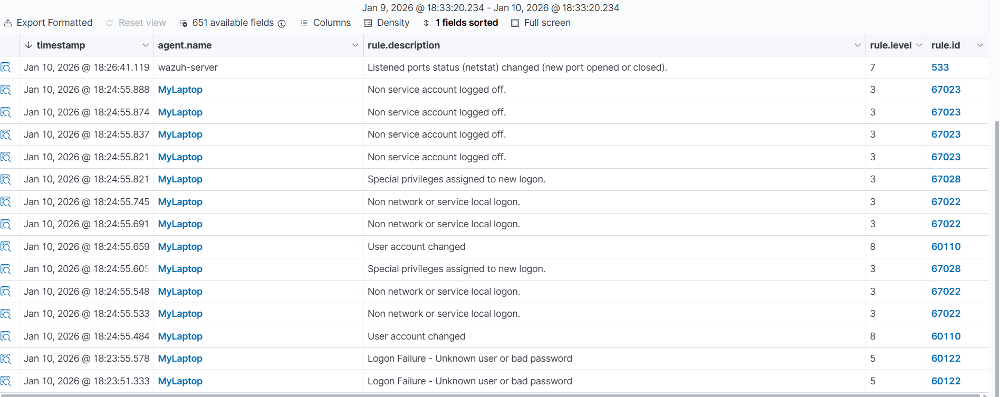
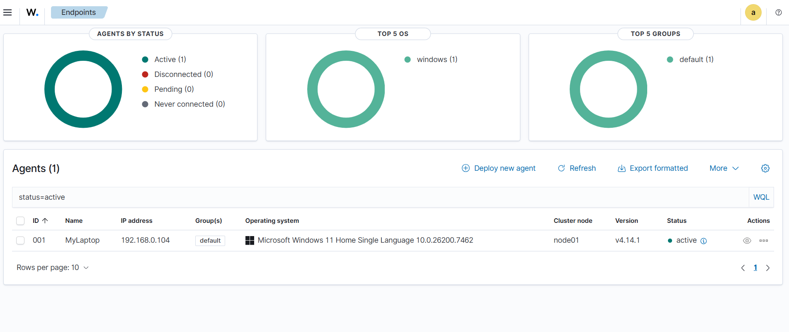

# 🛡️ Wazuh SIEM: Hardened Deployment & Security Monitoring

This project demonstrates the deployment of a **Wazuh Manager** within a hardened, **FIPS-compliant** environment. It serves as a centralized Security Operations Center (SOC) tool for real-time threat detection and vulnerability management.

## 🏗️ Architecture & Security
* **Platform:** Wazuh OVA (CentOS-based Hardened Image)
* **Encryption Standard:** **FIPS 140-2 Validated**
* **Network Protocol:** SSH (using NIST P-256 Elliptic Curves)
* **Authentication:** Asymmetric Key-based (No passwords used)

---

## 📊 SIEM Monitoring in Action

### 1. Security Event Dashboard
This dashboard provides a real-time overview of the security posture. As shown, the system has captured over 500 total alerts, including specific tracking for authentication failures.
)

### 2. Real-Time Alert Logs
Detailed breakdown of security events. The logs below capture critical events such as 'Logon Failures' and 'Special Privileges Assigned', which are essential for identifying potential brute-force or privilege escalation attempts.

### 3. Endpoint Management
Successfully integrated a Windows 11 endpoint (`MyLaptop`) as an active agent. The manager is now receiving telemetry, including IP address tracking and OS versioning.

---

## 🛠️ Technical Implementation Highlights
During the deployment, the **FIPS 140-2** kernel restricted standard SSH handshakes. I resolved this by:
1.  **Manual Cipher Negotiation:** Enforcing `ecdh-sha2-nistp256` to satisfy government-grade security policies.
2.  **Protocol Migration:** Switching from HTTPS to **SSH Public Key Authentication** to eliminate "Password-in-Cleartext" risks.
3.  **Secure Exfiltration:** Using `scp` and `ssh` tunnels to move data out of the isolated VM environment.

---
**Author:** Merin  
**Project:** 6th Sem Cybersecurity Portfolio
